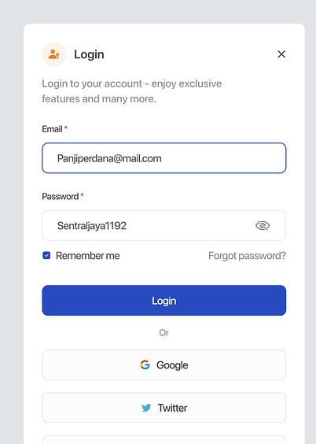

# authtentication

A new Flutter project to test your Firebase skill.

They will use Firebase for the authentication and also use it for the Google sign-in.
Exempt the Twitter sign-in. Once the user logs in, the following screen should have a button 
that logs the user out.

Fork this repository and make a pull request with your solution.

## Getting Started

This project is a starting point for a Flutter application.

Here are a few resources to get you started if this is your first Flutter project:

- [Lab: Write your first Flutter app](https://docs.flutter.dev/get-started/codelab)
- [Cookbook: Useful Flutter samples](https://docs.flutter.dev/cookbook)

For help getting started with Flutter development, view the
[online documentation](https://docs.flutter.dev/), which offers tutorials,
samples, guidance on mobile development, and a full API reference.
